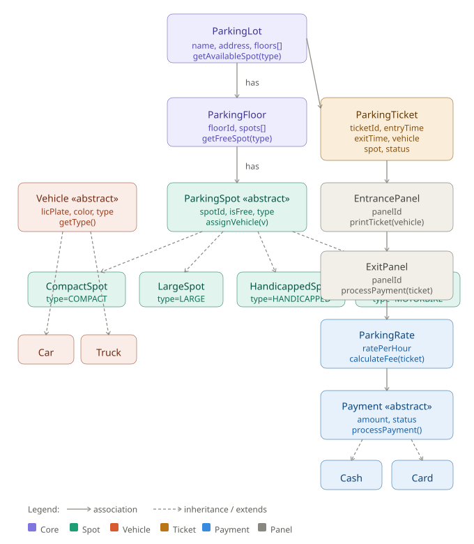

# 🅿️ Parking Lot — Low Level Design (Java)

A complete Low Level Design implementation of a Parking Lot system in Java, covering object-oriented principles, design patterns, and real-world parking workflows.

---

## 📐 Class Diagram

<p align="center">
  
</p>

---

## 🏗️ System Overview

The system models a multi-floor parking lot with support for multiple vehicle types, spot categories, ticketing, and payment processing.

---

## 📦 Package Structure

```
ParkingLot.java
│
├── Enums
│   ├── VehicleType        (CAR, TRUCK, MOTORBIKE, VAN)
│   ├── SpotType           (COMPACT, LARGE, HANDICAPPED, MOTORBIKE)
│   ├── ParkingTicketStatus (ACTIVE, PAID, LOST)
│   └── PaymentStatus      (PENDING, COMPLETED, FAILED)
│
├── Vehicle Hierarchy
│   ├── Vehicle            ← abstract base
│   ├── Car
│   ├── Truck
│   ├── Motorbike
│   └── Van
│
├── Spot Hierarchy
│   ├── ParkingSpot        ← abstract base
│   ├── CompactSpot
│   ├── LargeSpot
│   ├── HandicappedSpot
│   └── MotorbikeSpot
│
├── Core
│   ├── ParkingLot         ← Singleton
│   ├── ParkingFloor
│   ├── ParkingTicket
│   └── ParkingRate
│
├── Panels
│   ├── EntrancePanel
│   └── ExitPanel
│
└── Payment Hierarchy
    ├── Payment            ← abstract base
    ├── CashPayment
    └── CardPayment
```

---

## 🎯 Design Patterns Used

| Pattern | Where Applied | Purpose |
|---|---|---|
| **Singleton** | `ParkingLot` | Ensures only one lot instance exists |
| **Strategy** | `Payment` hierarchy | Swap payment methods without changing `ExitPanel` |
| **Template Method** | `ParkingSpot.canFitVehicle()` | Each spot subclass defines its own compatibility rule |
| **Factory-ready** | `ParkingSpot` subclasses | Easy to add new spot types |

---

## 🚗 Vehicle ↔ Spot Compatibility

| Vehicle Type | Compact | Large | Handicapped | Motorbike |
|---|:---:|:---:|:---:|:---:|
| Car | ✅ | ✅ | ✅ | ❌ |
| Truck | ❌ | ✅ | ❌ | ❌ |
| Motorbike | ✅ | ✅ | ❌ | ✅ |
| Van | ❌ | ✅ | ✅ | ❌ |

---

## 💰 Pricing Model

Base rate: **$5.00 / hour** (minimum 1 hour charged)

| Vehicle | Multiplier | Example (2 hrs) |
|---|---|---|
| Car / Motorbike | 1.0× | $10.00 |
| Van | 1.5× | $15.00 |
| Truck | 2.0× | $20.00 |

---

## 🔄 Core Workflows

### Vehicle Entry
```
EntrancePanel.admitVehicle(vehicle)
  └── ParkingLot.parkVehicle(vehicle)
        └── ParkingLot.getAvailableSpot(vehicle)   ← scans floors
              └── ParkingFloor.getFreeSpot(vehicle) ← checks canFitVehicle()
        └── ParkingSpot.assignVehicle(vehicle)
        └── new ParkingTicket(vehicle, spot)        ← ticket issued
```

### Vehicle Exit
```
ExitPanel.processExit(ticket, payment)
  └── ticket.checkout()                    ← stamps exit time
  └── ParkingRate.calculateFee(ticket)     ← computes duration + multiplier
  └── Payment.processPayment()             ← Cash or Card
  └── ParkingLot.releaseSpot(ticket)       ← frees the spot
  └── ticket.setStatus(PAID)
```

---

## 🚀 How to Run

**Requirements:** Java 14+ (uses `switch` expressions)

```bash
# Compile
javac ParkingLot.java

# Run
java ParkingLot
```

### Sample Output

```
--- Vehicles Arriving ---
[Entrance E1] Admitting: CAR [MH12AB1234, Red]
  Vehicle CAR [MH12AB1234, Red] parked at spot G-C1
  Ticket issued: TKT-1001

[Entrance E1] Admitting: TRUCK [MH14XY5678, Blue]
  Vehicle TRUCK [MH14XY5678, Blue] parked at spot G-L1
  Ticket issued: TKT-1002

--- Vehicles Departing ---
[Exit X1] Processing exit for: TKT-1001
  Fee: $5.00
  Cash payment of $20.00 accepted. Change: $0.00
  Exit complete. Spot released.

[Exit X1] Processing exit for: TKT-1002
  Fee: $10.00
  Card ending 1234 charged $10.00
  Exit complete. Spot released.
```

---

## 🔌 Extending the System

**Add a new spot type:**
```java
class ElectricSpot extends ParkingSpot {
    public ElectricSpot(String spotId) { super(spotId, SpotType.ELECTRIC); }

    @Override
    public boolean canFitVehicle(Vehicle vehicle) {
        return vehicle instanceof ElectricVehicle;
    }
}
```

**Add a new payment method:**
```java
class UPIPayment extends Payment {
    public UPIPayment(double amount, String upiId) { super(amount); }

    @Override
    public boolean processPayment() {
        // UPI gateway logic
        this.status = PaymentStatus.COMPLETED;
        return true;
    }
}
```

No changes required to `ExitPanel` or any existing class.

---

## 📁 Files

| File | Description |
|---|---|
| `ParkingLot.java` | Complete Java source — all classes in one file |
| `parking_lot_lld_class_diagram.svg` | UML class diagram (vector, scalable) |
| `README.md` | This file |

---

## 📝 License

MIT — free to use, adapt, and share.
