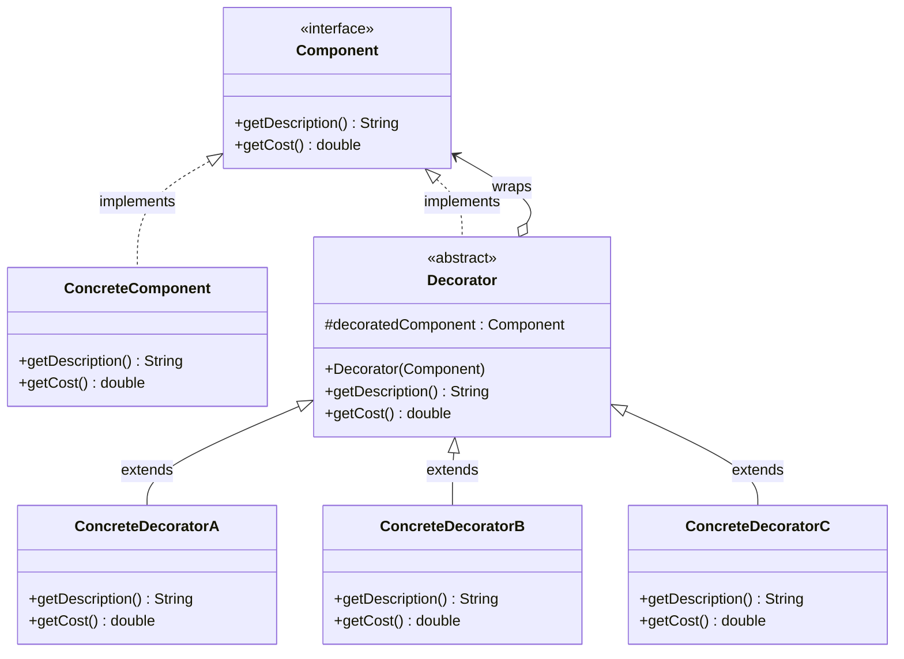

```mermaid
classDiagram
    class Component {
        <<interface>>
        +getDescription() String
        +getCost() double
    }

    class ConcreteComponent {
        +getDescription() String
        +getCost() double
    }

    class Decorator {
        <<abstract>>
        #decoratedComponent : Component
        +Decorator(Component)
        +getDescription() String
        +getCost() double
    }

    class ConcreteDecoratorA {
        +getDescription() String
        +getCost() double
    }

    class ConcreteDecoratorB {
        +getDescription() String
        +getCost() double
    }

    class ConcreteDecoratorC {
        +getDescription() String
        +getCost() double
    }

Component <|.. ConcreteComponent : implements
Component <|.. Decorator : implements
Decorator o--> Component : wraps
Decorator <|-- ConcreteDecoratorA : extends
Decorator <|-- ConcreteDecoratorB : extends
Decorator <|-- ConcreteDecoratorC : extends

```
