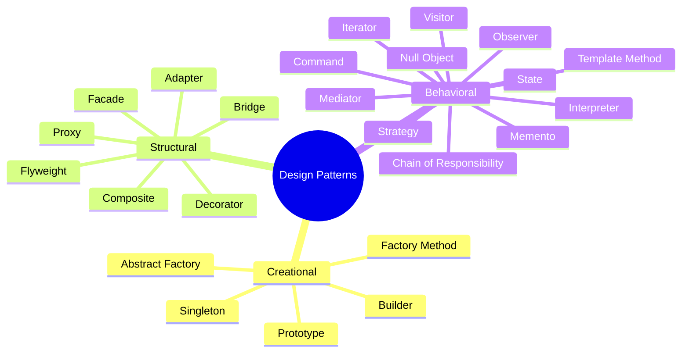
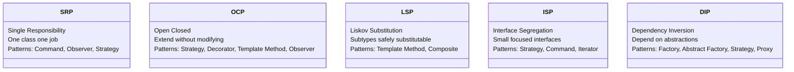

# 🧭 Design Pattern Quick-Reference Guide

> **How to pick the right pattern, fast.**
> A scenario-driven cheat sheet organized by Creational, Structural, and Behavioral categories — with decision trees, comparison tables, and real-world Java anchors.

---

## 📋 Table of Contents

1. [Pattern Category Map](#1-pattern-category-map)
2. [Creational Patterns — Quick Reference](#2-creational-patterns--quick-reference)
3. [Structural Patterns — Quick Reference](#3-structural-patterns--quick-reference)
4. [Behavioral Patterns — Quick Reference](#4-behavioral-patterns--quick-reference)
5. [Scenario → Pattern Decision Guide](#5-scenario--pattern-decision-guide)
6. [Anti-Pattern Warning Signs](#6-anti-pattern-warning-signs)
7. [Pattern Combination Recipes](#7-pattern-combination-recipes)
8. [SOLID Principle → Pattern Map](#8-solid-principle--pattern-map)
9. [Real-World Java API Mapping](#9-real-world-java-api-mapping)
10. [One-Line Pattern Definitions](#10-one-line-pattern-definitions)

---

## 1. Pattern Category Map



---

## 2. Creational Patterns — Quick Reference

> **Purpose:** Control *how* objects are created — decouple construction from usage.

```mermaid
classDiagram
    class Singleton {
        <<Creational>>
        Intent: One instance only
        Use when: Shared resource pool, config, logger
        Avoid when: Stateful — causes testing pain
        Java: Calendar.getInstance()
    }
    class FactoryMethod {
        <<Creational>>
        Intent: Subclass decides which class to instantiate
        Use when: Don't know class at compile time
        Avoid when: Only one product ever needed
        Java: DriverManager.getConnection()
    }
    class AbstractFactory {
        <<Creational>>
        Intent: Create families of related objects
        Use when: Products must be consistent
        Avoid when: Only one product type exists
        Java: DocumentBuilderFactory
    }
    class Builder {
        <<Creational>>
        Intent: Step-by-step complex object construction
        Use when: 4+ constructor params or optional fields
        Avoid when: Object is simple with 1-2 fields
        Java: StringBuilder, HttpRequest.newBuilder()
    }
    class Prototype {
        <<Creational>>
        Intent: Clone existing objects
        Use when: Creation is expensive
        Avoid when: Object has no meaningful copy semantics
        Java: Object.clone(), Collections.copy()
    }
```



| Pattern | When to USE ✅ | When to AVOID ❌ | Flexibility | Complexity |
|---|---|---|---|---|
| **Singleton** | Logger, DB pool, Config, Cache | Stateful services, unit-tested classes | 🔴 Low | 🟢 Low |
| **Factory Method** | Plugin systems, framework hooks | Simple `new` is sufficient | 🟡 Medium | 🟡 Medium |
| **Abstract Factory** | Cross-platform UI, themed components | Only one implementation family | 🟢 High | 🔴 High |
| **Builder** | Complex objects, optional params, immutability | Simple POJO with 1-2 fields | 🟡 Medium | 🟡 Medium |
| **Prototype** | Expensive init, object templates, game cloning | Simple objects with no deep state | 🟡 Medium | 🟡 Medium |

### Creational — Scenario Selector

```
❓ Do you need only ONE instance of a class?
   └── YES → Singleton

❓ Do you need to create objects but don't know which class at compile time?
   └── YES → Factory Method

❓ Do you need multiple types of objects that belong to a consistent family?
   └── YES → Abstract Factory

❓ Does your object have many optional fields or a complex multi-step build?
   └── YES → Builder

❓ Is creating a new object expensive and do you need many similar ones?
   └── YES → Prototype
```

---

## 3. Structural Patterns — Quick Reference

> **Purpose:** Control *how* objects are composed and connected — improve flexibility of structure.

| Pattern | Intent | Use When ✅ | Avoid When ❌ |
|---|---|---|---|
| **Adapter** | Make incompatible interfaces work together | Integrating legacy/third-party code you can't modify | You control both sides — just refactor the interface |
| **Bridge** | Separate abstraction from implementation | M×N class explosion (2 dimensions vary independently) | Only one dimension changes |
| **Composite** | Treat leaf and group objects uniformly | Tree structures — file systems, org charts, menus | No recursive structure needed |
| **Decorator** | Add behavior to objects dynamically | Many optional features composable at runtime | Fixed features known at compile time |
| **Façade** | Simplify a complex subsystem | Complex API/library with many entry points | Subsystem is already simple |
| **Flyweight** | Share fine-grained objects to save memory | Millions of similar objects (text rendering, particles) | Few objects or state is mostly unique |
| **Proxy** | Control access to another object | Lazy loading, caching, logging, security around a service | Direct access is acceptable and simpler |

### Structural — Scenario Selector

```
❓ Are you dealing with incompatible interfaces between old and new code?
   └── YES → Adapter

❓ Do you have TWO independent hierarchies that multiply (M shapes × N renderers)?
   └── YES → Bridge

❓ Do you need to treat a single item and a collection of items the same way?
   └── YES → Composite

❓ Do you want to add optional behaviors to objects at runtime without subclassing?
   └── YES → Decorator

❓ Does a subsystem have too many classes / methods and clients find it hard to use?
   └── YES → Façade

❓ Do you have millions of objects with shared state that wastes memory?
   └── YES → Flyweight

❓ Do you need to add lazy loading, logging, access control, or caching to a service?
   └── YES → Proxy
```

### Structural — Key Distinctions

```
Adapter  vs  Façade   → Adapter makes ONE class compatible.
                         Façade simplifies MANY classes.

Decorator vs Proxy    → Decorator ADDS behavior.
                         Proxy CONTROLS access.

Composite vs Iterator → Composite BUILDS the tree.
                         Iterator TRAVERSES the tree.

Bridge  vs  Strategy  → Bridge is STRUCTURAL (class hierarchy).
                         Strategy is BEHAVIORAL (algorithm swap).
```

---

## 4. Behavioral Patterns — Quick Reference

> **Purpose:** Control *how* objects communicate and distribute responsibility.

| Pattern | Intent | Use When ✅ | Key Benefit |
|---|---|---|---|
| **Chain of Responsibility** | Pass request along a chain until handled | Middleware, filters, escalation workflows | Decouple sender from handler |
| **Command** | Encapsulate a request as an object | Undo/Redo, job queues, macro recording | Parameterise and defer operations |
| **Interpreter** | Evaluate sentences in a grammar | Rule engines, expression parsers, DSLs | Model grammar as objects |
| **Iterator** | Traverse a collection without exposing internals | Custom collections, filtered traversal | Uniform traversal interface |
| **Mediator** | Centralise how objects interact | Chat rooms, ATC, event buses, complex UI | Reduce M×N coupling to M+N |
| **Memento** | Capture and restore object state | Undo/Redo, snapshots, game saves | Restore state without breaking encapsulation |
| **Null Object** | Provide a safe do-nothing substitute for null | Avoid null checks, optional collaborators | Eliminate NullPointerException |
| **Observer** | Notify dependents when state changes | Event systems, MVC, real-time dashboards | Loose coupling between subject and listeners |
| **State** | Change behaviour when internal state changes | Vending machines, order workflows, TCP connections | Replace state conditionals with classes |
| **Strategy** | Encapsulate interchangeable algorithms | Payment methods, sorting, compression | Swap algorithms at runtime |
| **Template Method** | Define algorithm skeleton, defer steps to subclasses | Frameworks, data miners, report generators | Reuse structure, customise steps |
| **Visitor** | Add operations to a structure without modifying it | ASTs, document processing, report generation | Add behaviour without changing element classes |

### Behavioral — Scenario Selector

```
❓ Do you need to try multiple handlers until one succeeds?
   └── YES → Chain of Responsibility

❓ Do you need Undo/Redo, or to queue / schedule operations?
   └── YES (actions)  → Command
   └── YES (state)    → Memento

❓ Do you need to parse a custom language, DSL, or rule expression?
   └── YES → Interpreter

❓ Do you need to traverse a collection without knowing its internals?
   └── YES → Iterator

❓ Do multiple objects need to communicate, creating a tangled web?
   └── YES → Mediator

❓ Do you keep checking for null before calling methods?
   └── YES → Null Object

❓ Does one object's change need to notify many others automatically?
   └── YES → Observer

❓ Does an object's behaviour depend heavily on its current state?
   └── YES → State

❓ Do you need to swap algorithms or policies at runtime?
   └── YES → Strategy

❓ Do you have a fixed algorithm with steps that vary by subclass?
   └── YES → Template Method

❓ Do you need to add new operations to a class hierarchy without changing those classes?
   └── YES → Visitor
```

### Behavioral — Key Distinctions

```
Command  vs  Strategy  → Command encapsulates an ACTION (with undo).
                          Strategy encapsulates an ALGORITHM (no undo).

Observer vs  Mediator  → Observer is broadcast (subject unaware of listeners).
                          Mediator is hub-and-spoke (mediator aware of all).

State    vs  Strategy  → State transitions INTERNALLY (object changes itself).
                          Strategy is set EXTERNALLY (client injects it).

Template vs  Strategy  → Template uses INHERITANCE (override steps).
                          Strategy uses COMPOSITION (inject behaviour).

Memento  vs  Command   → Memento saves OBJECT STATE for restore.
                          Command saves OPERATIONS for undo/replay.

Iterator vs  Visitor   → Iterator TRAVERSES without operating.
                          Visitor OPERATES while traversing.
```

---

## 5. Scenario → Pattern Decision Guide

### 🏗️ Object Creation Scenarios

| Scenario | Pattern | Why |
|---|---|---|
| Need exactly one shared instance (DB pool, config) | **Singleton** | Guarantees single creation |
| Creating objects but type decided at runtime | **Factory Method** | Defers instantiation to subclasses |
| Need consistent families (Windows UI vs Mac UI) | **Abstract Factory** | Ensures family compatibility |
| Object has 5+ params, many optional | **Builder** | Fluent readable construction |
| Many similar objects, expensive to create from scratch | **Prototype** | Clone instead of new |
| Need to hide `new` complexity from client | **Factory Method** | Encapsulates creation logic |
| Config-driven object creation | **Abstract Factory** | Swap entire implementation family |

### 🔧 Code Integration Scenarios

| Scenario | Pattern | Why |
|---|---|---|
| Using a third-party library with wrong interface | **Adapter** | Convert without modifying either side |
| Two hierarchies growing independently | **Bridge** | Decouple to M+N instead of M×N |
| Adding features to objects without subclassing | **Decorator** | Runtime wrapping |
| Simplifying a complex legacy API | **Façade** | Single clean entry point |
| Need lazy init / access control / logging on a service | **Proxy** | Transparent interception |
| Millions of nearly identical objects eating memory | **Flyweight** | Share intrinsic state |
| Need to treat a tree node and the whole tree the same | **Composite** | Uniform leaf/composite interface |

### ⚡ Behaviour & Communication Scenarios

| Scenario | Pattern | Why |
|---|---|---|
| Ctrl+Z Undo / Redo | **Command + Memento** | Command records action; Memento records state |
| Multiple handlers should try in order | **Chain of Responsibility** | Pass until handled |
| Many objects communicate causing spaghetti | **Mediator** | Central hub |
| Object must react differently based on state | **State** | Each state is its own class |
| Notify many objects when something changes | **Observer** | Decoupled broadcast |
| Algorithm varies but structure is the same | **Template Method** | Fix skeleton, vary steps |
| Payment / shipping / tax strategy switches at runtime | **Strategy** | Inject behaviour |
| Traverse custom data structure cleanly | **Iterator** | Standard traversal contract |
| Add export/report operations to existing classes | **Visitor** | New operation = new visitor |
| Evaluate boolean rules / expressions | **Interpreter** | Grammar as objects |
| Calling methods on possibly-null collaborator | **Null Object** | Safe do-nothing |
| Save game state / checkpoint | **Memento** | Snapshot without breaking encapsulation |

---

## 6. Anti-Pattern Warning Signs

> Code smells that signal you need a design pattern.

| Code Smell | Problem | Pattern Cure |
|---|---|---|
| `if type == "A" ... else if type == "B"...` growing every sprint | Open/Closed violation | **Strategy** or **Factory Method** |
| `new ConcreteService()` inside business logic | Dependency Inversion violation | **Factory** + **Dependency Injection** |
| Class with 10+ unrelated methods | Single Responsibility violation | Split into focused classes |
| `if (obj != null) obj.doSomething()` repeated everywhere | Null fragility | **Null Object** |
| `instanceof` chains for type checking | Tight coupling to concretions | **Visitor** or **Strategy** |
| `UnsupportedOperationException` in interface implementations | Interface Segregation violation | **ISP** — split the interface |
| Subclass overrides method to throw exception | Liskov Substitution violation | Redesign hierarchy; use composition |
| God class owning all coordination logic | High coupling | **Mediator** |
| Duplicate algorithm with minor variations | DRY violation | **Template Method** |
| Adding DB/email/log calls inside domain objects | SRP violation | Separate service classes |
| Thousands of small objects eating heap | Memory bloat | **Flyweight** |
| Accessing object through deep call chains | Law of Demeter violation | **Façade** or **Mediator** |

---

## 7. Pattern Combination Recipes

> Patterns that work best together in real systems.

### Recipe 1 — Undo / Redo System
```
Command   → encapsulates each user action as an object
Memento   → snapshots editor state before each command
Composite → groups multiple commands into a single MacroCommand

Flow: User Action → Command.execute() + Memento.save()
      Ctrl+Z      → Command.undo()   + Memento.restore()
```

### Recipe 2 — Plugin / Extension System
```
Factory Method    → creates plugin instances without knowing concrete types
Strategy          → each plugin provides its own algorithm
Observer          → plugins subscribe to system events
Chain of Responsibility → plugins ordered in a processing pipeline
```

### Recipe 3 — Event-Driven Dashboard
```
Observer    → data sources notify dashboard components on change
Strategy    → each chart uses its own rendering algorithm
Composite   → dashboard is a tree of widgets (panels, charts, labels)
Flyweight   → shared styles / themes across thousands of cells
```

### Recipe 4 — HTTP Request Pipeline (e.g. Spring / Servlet)
```
Chain of Responsibility → filters: Auth → Rate Limit → Logging → Handler
Command                 → each request is encapsulated as a handler command
Template Method         → base servlet defines handle(); subclasses fill doGet/doPost
Proxy                   → AOP wraps methods with @Transactional, @Cacheable
```

### Recipe 5 — Document / Report Generator
```
Composite  → document is a tree (Section → Paragraph → Text)
Iterator   → traverse all elements in order
Visitor    → HTML exporter, PDF exporter, word counter all as separate visitors
Builder    → construct the document section by section
Strategy   → choose output format at runtime
```

### Recipe 6 — Game / Simulation Engine
```
State      → character state machine (IDLE → RUNNING → ATTACKING → DEAD)
Observer   → health, score, inventory subscribe to game events
Flyweight  → shared sprite/texture data across thousands of entities
Prototype  → clone base character templates to spawn new instances
Command    → record player moves for replay or AI scripting
```

### Recipe 7 — E-Commerce Order System
```
Builder             → construct complex Order objects
Strategy            → payment method, discount, shipping strategy
Observer            → order status change notifies email/SMS/push
State               → order lifecycle: PENDING → CONFIRMED → SHIPPED → DELIVERED
Chain of Responsibility → fraud check → inventory check → payment → fulfillment
Factory Method      → create platform-specific payment gateway
Null Object         → default NoDiscount when no promo code applied
```

---

## 8. SOLID Principle → Pattern Map



| SOLID Principle | Violated By | Patterns That Fix It |
|---|---|---|
| **S** — Single Responsibility | God class, too many reasons to change | Command, Observer, Strategy, Mediator |
| **O** — Open / Closed | `if-else` on type, modifying core to add feature | Strategy, Decorator, Observer, Factory Method, Template Method |
| **L** — Liskov Substitution | Subclass throws UnsupportedOperation, overrides to do nothing | Template Method, Composite, proper hierarchy design |
| **I** — Interface Segregation | Fat interface forces empty method implementations | Strategy, Command, Iterator, split interfaces |
| **D** — Dependency Inversion | `new ConcreteClass()` in high-level module | Factory Method, Abstract Factory, Strategy, Proxy, Builder |

---

## 9. Real-World Java API Mapping

| Java / Framework Class | Pattern Applied |
|---|---|
| `java.util.Comparator` | **Strategy** — pluggable sort algorithm |
| `java.util.Iterator` | **Iterator** — uniform traversal |
| `java.io.InputStream` → `BufferedInputStream` → `GZIPInputStream` | **Decorator** — layered byte stream |
| `java.lang.reflect.Proxy` | **Proxy** — dynamic invocation handler |
| `java.util.Calendar.getInstance()` | **Factory Method** — locale-specific subclass |
| `Integer.valueOf(-128 to 127)` | **Flyweight** — cached boxed integers |
| `Boolean.TRUE` / `Boolean.FALSE` | **Flyweight** — only 2 Boolean objects ever |
| `java.lang.Runnable` | **Command** — encapsulated action |
| `java.util.Observable` (deprecated) | **Observer** — classic pub/sub |
| `javax.swing.undo.UndoManager` | **Memento** — undo/redo history |
| `HttpServlet.service()` | **Template Method** — skeleton dispatches to doGet/doPost |
| `java.awt.Component` tree | **Composite** — UI component hierarchy |
| `java.sql.Connection` → creates Statement, PreparedStatement | **Abstract Factory** — DB-specific product family |
| `Collections.emptyList()` / `Optional.empty()` | **Null Object** — safe empty values |
| `java.util.logging` `Handler` chain | **Chain of Responsibility** — log record processing |
| Spring `@Transactional` / `@Cacheable` / `@Async` | **Proxy** — AOP wrapping via dynamic proxy |
| Spring `@EventListener` / `ApplicationEventPublisher` | **Observer** — application event bus |
| Spring `@Autowired` constructor injection | **Dependency Inversion** — inject abstractions |
| Hibernate lazy-loaded entities | **Proxy** — virtual proxy delays DB load |
| OkHttp `Interceptor` chain | **Chain of Responsibility** — HTTP middleware |
| `java.util.Arrays.asList()` | **Adapter** — array to List |
| `java.io.InputStreamReader` | **Adapter** — byte stream to char reader |

---

## 10. One-Line Pattern Definitions

> The fastest possible reference.

### 🏗️ Creational

| Pattern | One Line |
|---|---|
| **Singleton** | One instance, global access, private constructor. |
| **Factory Method** | Let subclasses decide which object to create. |
| **Abstract Factory** | A factory that creates consistent families of objects. |
| **Builder** | Build complex objects step by step with a fluent API. |
| **Prototype** | Clone an existing object instead of building from scratch. |

### 🔧 Structural

| Pattern | One Line |
|---|---|
| **Adapter** | Plug an incompatible interface in without modifying either side. |
| **Bridge** | Separate what something does from how it does it. |
| **Composite** | Treat a leaf and a group of leaves exactly the same way. |
| **Decorator** | Wrap an object to add behaviour without changing its class. |
| **Façade** | One simple door into a complex building. |
| **Flyweight** | Share what's common; pass what's unique. |
| **Proxy** | Same interface, extra layer — control, cache, or log. |

### ⚡ Behavioral

| Pattern | One Line |
|---|---|
| **Chain of Responsibility** | Don't call us, we'll pass to the next one. |
| **Command** | An action wrapped in an object — queueable and undoable. |
| **Interpreter** | Model grammar as objects, evaluate by composing them. |
| **Iterator** | Traverse without peeking inside. |
| **Mediator** | Talk to the control tower, not to each other. |
| **Memento** | Snapshot the past, restore the present. |
| **Null Object** | Give a real object that does nothing instead of nothing. |
| **Observer** | Don't call us, we'll call you — when something changes. |
| **State** | Objects change personality based on their internal state. |
| **Strategy** | Swap the algorithm, not the class. |
| **Template Method** | Define the plan, delegate the details. |
| **Visitor** | Add operations to a structure without touching its classes. |

---

## Summary Table — All 24 Patterns at a Glance

| # | Category | Pattern | Core Intent | Key Benefit | Complexity |
|---|---|---|---|---|---|
| 1 | Creational | Singleton | One instance only | Shared resource control | 🟢 Low |
| 2 | Creational | Factory Method | Subclass decides creation | Decouple client from type | 🟡 Medium |
| 3 | Creational | Abstract Factory | Family of related objects | Family consistency | 🔴 High |
| 4 | Creational | Builder | Fluent step-by-step build | Readable immutable objects | 🟡 Medium |
| 5 | Creational | Prototype | Clone expensive objects | Fast object creation | 🟡 Medium |
| 6 | Structural | Adapter | Bridge incompatible interfaces | Integrate without modification | 🟡 Medium |
| 7 | Structural | Bridge | Decouple abstraction/impl | Independent variation | 🔴 High |
| 8 | Structural | Composite | Uniform leaf and group | Recursive tree structures | 🟡 Medium |
| 9 | Structural | Decorator | Wrap to add behaviour | Runtime feature composition | 🟡 Medium |
| 10 | Structural | Façade | Simplify complex subsystem | Single clean entry point | 🟢 Low |
| 11 | Structural | Flyweight | Share fine-grained objects | Massive memory saving | 🔴 High |
| 12 | Structural | Proxy | Controlled access surrogate | Lazy load, security, cache | 🟡 Medium |
| 13 | Behavioral | Chain of Responsibility | Pass until handled | Decouple sender/handler | 🟡 Medium |
| 14 | Behavioral | Command | Request as an object | Undo/Redo, queuing | 🟡 Medium |
| 15 | Behavioral | Interpreter | Grammar as classes | Evaluate mini-languages | 🔴 High |
| 16 | Behavioral | Iterator | Traverse without exposing | Uniform collection access | 🟢 Low |
| 17 | Behavioral | Mediator | Central communication hub | Reduce M×N to M+N | 🟡 Medium |
| 18 | Behavioral | Memento | Snapshot and restore | Undo without breaking encapsulation | 🟡 Medium |
| 19 | Behavioral | Null Object | Safe do-nothing substitute | Eliminate null checks | 🟢 Low |
| 20 | Behavioral | Observer | Broadcast state changes | Loose subject/listener coupling | 🟡 Medium |
| 21 | Behavioral | State | Behaviour by state | Replace state conditionals | 🟡 Medium |
| 22 | Behavioral | Strategy | Interchangeable algorithms | Runtime algorithm swap | 🟢 Low |
| 23 | Behavioral | Template Method | Skeleton with variable steps | Reuse structure | 🟡 Medium |
| 24 | Behavioral | Visitor | New ops without class change | Extend without modification | 🔴 High |

---

> **Golden Rule:** Use patterns to solve problems you *have*, not problems you *might have*.
> Apply the simplest solution first — reach for a pattern only when it reduces coupling,
> improves extensibility, or eliminates a recurring code smell.
